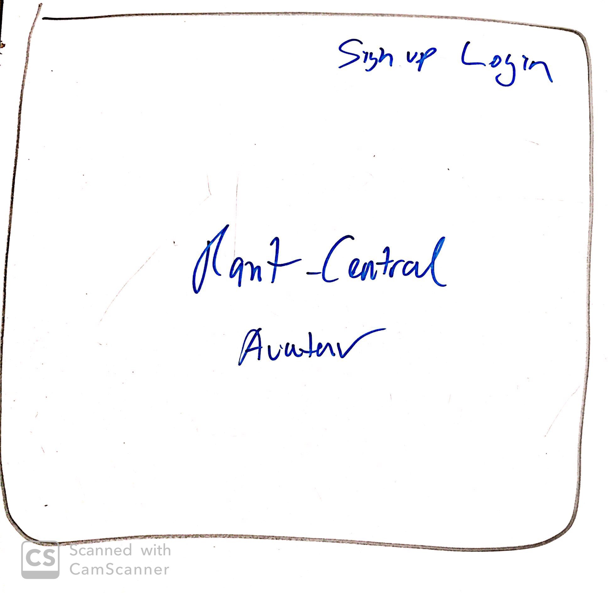
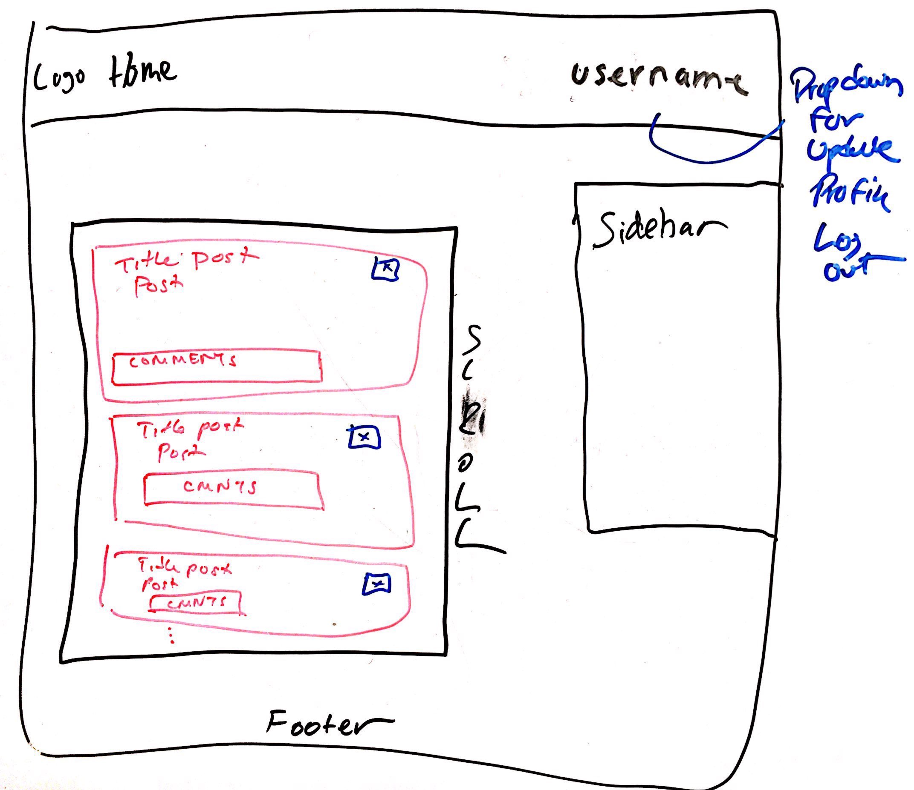
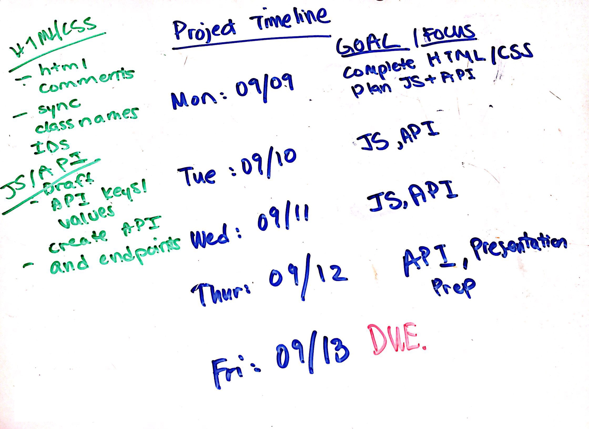
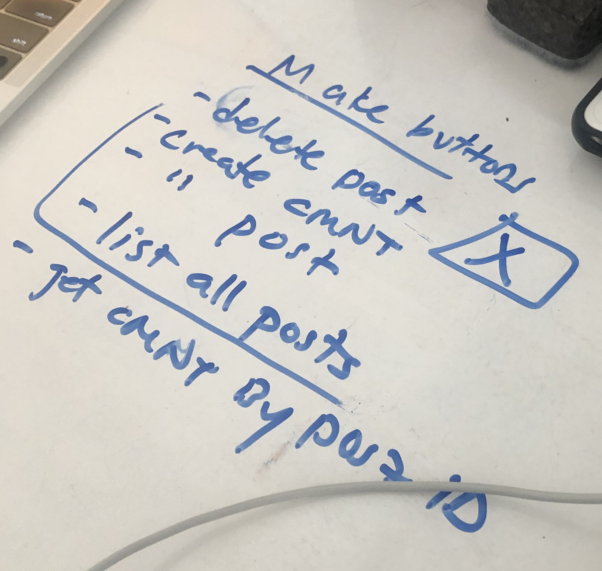
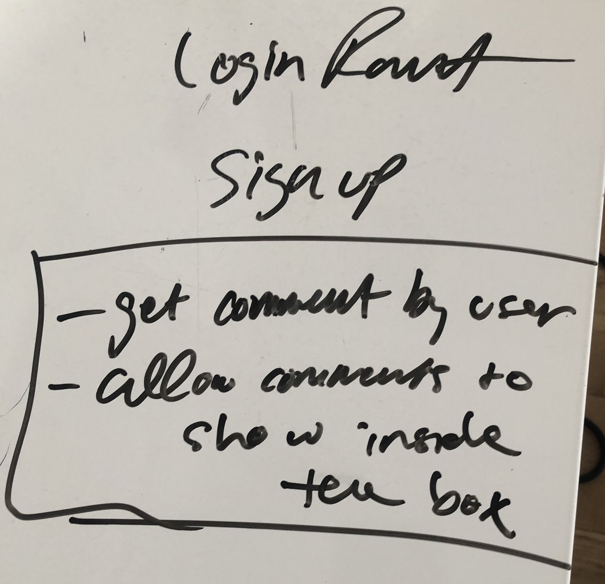
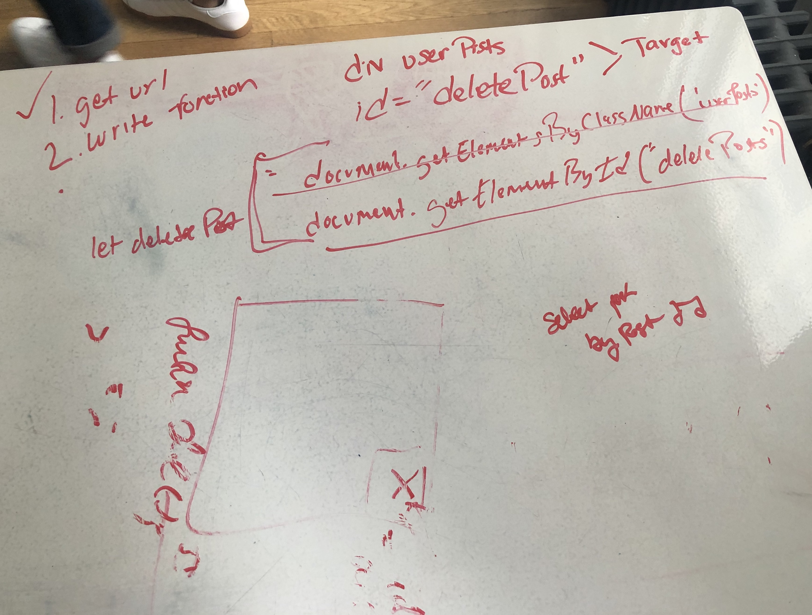

# rant-central
Rant Central is where you can go to post anything you want without judgement. This project is a rough clone of the popular discussion site, Reddit. Once an account is created, a user is directed to a posts feed. They have the ability to view other posts, create their own posts, create comments, and delete their own comments. They can also create a profile, list their posts and comments, and update their profile. After their rant they can log out, and log back in any time. 

# Team Members
Christine Le (@<a href="https://github.com/le-christine">le-christine</a>) 
Ramel Haines (@<a href="https://github.com/EngineerMel">EngineerMel</a>)

# Technologies Used
1. HTML
2. CSS
3. JavaScript
4. Fetch AJAX and API
5. API used: http://thesi.generalassemb.ly:8080

# General Approach
We reviewed the project requirements and sketched a wireframe. We kept the design simple, and added key features to make interactions as seamless as possible (e.g. dropdown menu to update profile and logout). On Day 1 we planned our week, scheduling most of the time for writing JavaScript functions to carry out Fetch API / AJAX requests. There are two pages, a landing page and a main page that loads all posts. They both read from the same styling and script files. 

| Day            | 1                                    | 2                                            | 3                                                   | 4                                                     |
|----------------|--------------------------------------|----------------------------------------------|-----------------------------------------------------|-------------------------------------------------------|
| Morning Task   | create files, complete HTML/CSS      | POST: signup,  POST: login, Page redirection | GET: all posts, POST: create profile                | 15 min stand-up, GET: comments, DELETE: comment       |
| Afternoon Task | Read API schema, Add event listeners | POST: update profile                         | Refactor HTML and CSS for redundancy                | DELETE: post, Fix signup, login, update profile forms |
| Evening Task   |                                      | POST: create post Manipulate DOM             | POST: create comment, GET: comments, Manipulate DOM | Clean-up, Ad-hoc testing                              |

# Unsolved problems

1. Have a separate profile page or window, rather than a sidebar.
2. Improve design and add larger text input for posts and comments. 
3. Add time posted to posts.
4. Add responsiveness to the pages.

# Planning
<html>
  

  
  
  
  
  
  
  

</html>
